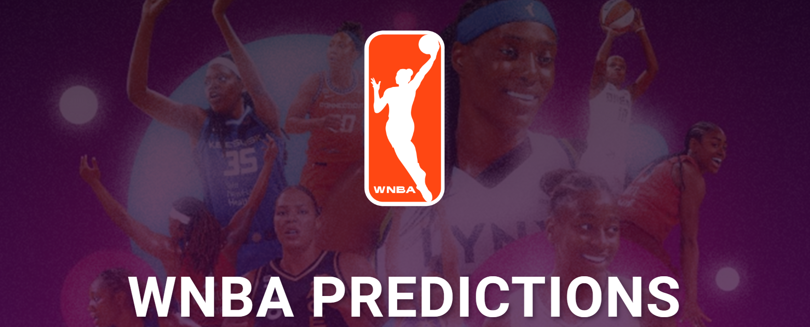

  

# Self Assedment 

## Analysis:
### segment 1

my role was circle for this part in charge of the mockup database. I used PostgreSQL and designed an ERD of the database and document for support how I integrated into the database and how it works with code. Also, I set up my repository branch and started to work with my teammates pull and push the different files we needed for completed the requirements on the week. The data set was retrieved for the https://www.basketball-reference.com/ putting together the data for the last 25 years of WNBA seasons. 

### Segment 2 

My role was triangle for the second part of the project, I kept working in the database. The next steps were clean the data and using pandas for make some modifications, drop columns, or changed the formats. Finally, we load the data from the Jupiter notebook into to the PostgreSQL, two tables are fully completed in this point one with the past seasons and one with the current season. 

### Segment 3
Sport prediction is usually treated as a classification problem, with one class (win, lose, or draw) to be predicted. Although some researchers, have also looked at the numeric prediction problem, where they predict the winning margin – a numeric value. In sport prediction, large numbers of features can be collected including the historical performance of the teams, results of matches, and data on players, to help different stakeholders understand the odds of winning or losing forthcoming matches. The decision of which team is likely to win is what we are aiming to predict.
My role for this part of the process was triangle, in this point I done with the database so this week in be involved in help with the presentations and deleted the unnecessary files and make sure about the model we going to use and how it would be answer the questions, also started to work in a web page for show the results and the models, include the tableau stories. 
### Segment 4

During this last segment, my role was the square in charge to finalize the README in the project repository. This means making sure the conclusion and any additional observations made by the team over the course of the project have been added to it.

## Summary:
• Data was scrapped from https://www.basketball-reference.com/ , saved as .csv. (between season 1997-98 to 2021-22) • Total of twenty five tables, one for every season.
• Datasets loaded into PostgreSQL database using python. (database_initial_load.ipynb)
• Updated datasets saved as csv(Folder "other/stats.cvs and cy_stats1), cleaned and loaded into database. (database_load.ipynb)
• Column name changed inside database
• All 2 datasets consist of the same columns/features. This columns/features consisted of Win pct, Margin of victory, Pace, Offensive rating, Defensive rating plus five columns with team advance stats and another five with opponents advance stats.
•	Collaborate with the presentation for google slides and web page. 

## Challenge:
The first challenge was creating the final dataset because the stats in the web site is only for each season, but you can’t retrieve it for all the seasons also this need some modifications for be set up for the models and the database. 
Work in the web page was a big challenge for me and enjoyed being creative and put all the hard work for weeks together in one site. 

# Team assessment 
* The communications protocols: 
We keep in touch via slack, zoom and make sure about each branch and the final repository have the necessary files each week. 
* Tips and trick: 
Each teammate works in the aspect of the project was considered his strength and help each other with recommendations and tips. 

# Summary project: 
### ML Models: to predicted the winner of the championship we used 3 different machine learning models, the results show the team most likely to win. 

* Logistic Regression
Las Vegas Aces
* Decision Tree
Las Vegas Aces,Connecticut Sun
* Random Forest
Connecticut Sun

* Data was scrapped from https://www.basketball-reference.com/

* ERD https://www.quickdatabasediagrams.com/

* Google slides [Wnba Predictions_presentations](https://docs.google.com/presentation/d/10bAOWkrWM3veIdgE84QRVg1vOGXGeJDbY-aToJUFGBc/edit?usp=sharing)

* web page 

[Wnba Predictions](https://rafajos20.github.io/wnba_predictions/)

